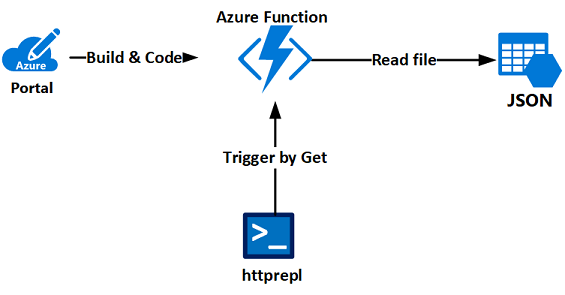

---
lab:
    title: 'Lab: Implement task processing logic by using Azure Functions'
    az204Module: 'Module 02: Implement Azure Functions'
---

# Lab: Implement task processing logic by using Azure Functions

## Microsoft Azure user interface

Given the dynamic nature of Microsoft cloud tools, you might experience Azure user interface (UI) changes after the development of this training content. These changes might cause the lab instructions and lab steps to not match.

Microsoft updates this training course when the community brings needed changes to our attention; however, because cloud updates occur frequently, you might encounter UI changes before this training content updates. **If this occurs, adapt to the changes, and then work through them in the labs as needed.**

## Instructions

In the lab you will build http triggered and schedule triggered functions in-portal. Final Http-triggered function will be triggered from console and retrieve the file from storage account.




### Before you start

#### Review the installed applications

Find the taskbar on your Windows 10 desktop. The taskbar contains the icons for the applications that you'll use in this lab:
    
-   Microsoft Edge

-   File Explorer

-   Windows Terminal

### Exercise 1: Create Azure resources

#### Task 1: Open the Azure portal

1. On the taskbar, select the **Microsoft Edge** icon.
1. In the open browser window, go to the Azure portal (<https://portal.azure.com>).
1. Enter the email address for your Microsoft account, and then select **Next**.
1. Enter the password for your Microsoft account, and then select **Sign in**.
    > **Note**: If this is your first time signing in to the Azure portal, you'll be offered a tour of the portal. If you prefer to skip the tour, select **Get Started** to begin using the portal.

#### Task 2: Create an Azure Storage account

1.  In the Azure portal's navigation pane, select **All services**.

1.  On the **All services** blade, select **Storage Accounts**.

1.  On the **Storage accounts** blade, get your list of storage account instances.

1.  On the **Storage accounts** blade, select **Add**.

1.  On the **Create storage account** blade, observe the tabs on the blade, such as **Basics**, **Tags**, and **Review + Create**.

    > **Note**: Each tab represents a step in the workflow to create a new storage account. You can select **Review + Create** at any time to skip the remaining tabs.

1.  Select the **Basics** tab, and then in the tab area, perform the following actions:
    
    1.  Leave the **Subscription** text box set to its default value.
    
    1.  In the **Resource group** section, select **Create new**, enter **Serverless**, and then select **OK**.
    
    1.  In the **Storage account name** text box, enter **funcstor*[yourname]***.
    
    1.  In the **Location** list, select the **(US) East US** region.
    
    1.  In the **Performance** section, select **Standard**.
    
    1.  In the **Account kind** list, select **StorageV2 (general purpose v2)**.
    
    1.  In the **Replication** list, select **Locally-redundant storage (LRS)**.
    
    1.  Select **Review + Create**.

1.  On the **Review + Create** tab, review the options that you specified in the previous steps.

1.  Select **Create** to create the storage account by using your specified configuration.

    > **Note**: On the **Deployment** blade, wait for the creation task to complete before moving forward with this lab.
1. In the Azure portal's navigation pane, select **All services**.
1. On the **All services** blade, select **Storage Accounts**.
1. On the **Storage accounts** blade, select the **funcstor[yourname]** storage account instance.
1. From the **Storage account** blade, find the **Settings** section, and then select **Access keys**.
1. From the **Access keys** blade, select any one of the keys, and then record the value of either of the **Connection string** boxes.
    > **Note**: You'll use this value later in the lab. It doesn't matter which connection string you choose. They are interchangeable.

#### Task 3: Create a Function app

1.  In the Azure portal's navigation pane, select the **Create a resource** link.

1.  From the **New** blade, find the **Search the Marketplace** text box.

1.  In the search box, enter **Function**, and then select Enter.

1.  On the **Everything** search results blade, select the **Function App** result.

1.  On the **Function App** blade, select **Create**.

1.  Find the tabs on the **Function App** blade, such as **Basics**.

    > **Note**: Each tab represents a step in the workflow to create a new function app. You can select **Review + Create** at any time to skip the remaining tabs.

1.  On the **Basics** tab, perform the following actions:
    
    1.  Leave the **Subscription** text box set to its default value.
    
    1.  In the **Resource group** section, select **Use existing**, and then select **Serverless** in the list.
    
    1.  In the **Function app name** text box, enter **funclogic*[yourname]***.

    1.  In the **Publish** section, select **Code**.

    1.  In the **Runtime stack** drop-down list, select **Node.js**.

    1.  In the **Region** drop-down list, select the **East US** region.
    
    1.  Select **Next: Hosting**.

1.  On the **Hosting** tab, perform the following actions:

    1.  In the **Storage account** drop-down list, select the **funcstor*[yourname]*** storage account that you created earlier in this lab.

    1.  In the **Operating System** section, select **Windows**.

    1.  In the **Plan type** drop-down list, select the **Consumption** option.

    1.  Select **Review + Create**.

1.  On the **Review + Create** tab, review the options that you selected during the previous steps.

1.  Select **Create** to create the function app by using your specified configuration. 

    > **Note**: Wait for the creation task to complete before you move forward with this lab.

#### Review

In this exercise, you created all the resources that you'll use for this lab.

### Exercise 2: Create a function that's triggered by an HTTP request

#### Task 1: Create an HTTP-triggered function

1.  In the Azure portal's navigation pane, select the **Resource groups** link.

1.  On the **Resource groups** blade, find and then select the **Serverless** resource group that you created earlier in this lab.

1.  On the **Serverless** blade, select the **funclogic*[yourname]*** function app that you created earlier in this lab.

1.  On the **Function Apps** blade, select the **Functions** and click on plus sign (**+ Add**) next to top.

1.  In the **New  Function** perform the following actions:
    
    
    1.  In the list of templates, select **HTTP trigger**.
    
    1.  In the **New Function** pop-up window, find the **Name** text box, and then enter **Echo**.
    
    1.  In the **New Function** pop-up window, find the **Authorization level** list, and then select **Anonymous**.
    
    1.  In the **New Function** pop-up window, select **Create**.

#### Task 2: Write function code

1. When the function is created click on **Code + Test** on left. 

1.  In the function editor, find the example **index.js** function script:

```JavaScript
module.exports = async function (context, req) {
    context.log('JavaScript HTTP trigger function processed a request.');

    const name = (req.query.name || (req.body && req.body.name));
    const responseMessage = name
        ? "Hello, " + name + ". This HTTP triggered function executed successfully."
        : "This HTTP triggered function executed successfully. Pass a name in the query string or in the request body for a personalized response.";

    context.res = {
        // status: 200, /* Defaults to 200 */
        body: responseMessage
    };
}
```

1.  Delete all the example code.

1.  Add the following lines of code to the function app:

```JavaScript
module.exports = async function (context, req) {
    
    context.log('Received a request');

    context.res = {
        body: req.body
    };
}
```

1.  Select **Save** to save the script. 

1.  The function should simply return what you send like echo.

#### Task 3: Test function run in the portal

1.  Select **Logs**.

1.  Observe the compilation results. The results should include a "Compilation succeeded" message.

1.  Select **Run** to test the function.

1.  Observe the results of the test run. The results should echo the original request body exactly.

#### Task 4: Get a base function URL

1.  In the Azure portal's navigation pane, select the **Resource groups** link.

1.  On the **Resource groups** blade, find and then select the **Serverless** resource group that you created earlier in this lab.

1.  On the **Serverless** blade, select the **funclogic*[yourname]*** function app that you created earlier in this lab.

1.  On the **Function Apps** blade, copy the value of the **URL** text box. You'll use this value later in the lab.

#### Task 5: Test function run by using httprepl

1.  On the taskbar, select the **Windows Terminal** icon.

1.  At the open command prompt, enter the following command, and then select Enter to start the **httprepl** tool setting the base Uniform Resource Identifier (URI) to the value of the URL that you copied earlier in this lab.

    > You can [download and install](https://docs.microsoft.com/en-us/aspnet/core/web-api/http-repl?view=aspnetcore-3.1&tabs=windows#installation) tool by run command: **dotnet tool install -g Microsoft.dotnet-httprepl**


    ```CMD
    httprepl <function-app-url>
    ```

    > **Note**: For example, if your URL is **https://funclogicstudent.azurewebsites.net**, your command would be **httprepl https://funclogicstudent.azurewebsites.net**.

1.  At the tool prompt, enter the following command, and then select Enter to browse to the relative **api** directory:

    ```
    cd api
    ```

1.  Enter the following command, and then select Enter to browse to the relative **echo** directory:

    ```
    cd echo
    ```

1.  Enter the following command, and then select Enter to run the **post** command sending in an HTTP request body set to a numeric value of **3** by using the **\-\-content** option:

    ```
    post --content 3
    ```

1.  Enter the following command, and then select Enter to run the **post** command sending in an HTTP request body set to a numeric value of **5** by using the **\-\-content** option:

    ```
    post --content 5
    ```

1.  Enter the following command, and then select Enter to run the **post** command sending in an HTTP request body set to a string value of **Hello** by using the **\-\-content** option:

    ```
    post --content "Hello"
    ```

1.  Enter the following command, and then select Enter to run the **post** command sending in an HTTP request body set to a JavaScript Object Notation (JSON) value of **{"msg": "Successful"}** by using the **\-\-content** option:

    ```
    post --content "{"msg": "Successful"}"
    ```

1.  Enter the following command, and then select Enter to exit the **httprepl** application:

    ```
    exit
    ```

1.  Close the currently running Windows Terminal application.

1.	Return to the browser window with the Azure portal.

#### Review

In this exercise, you created a basic function that echoes the content sent via an HTTP POST request.

### Exercise 3: Create a function that triggers on a schedule

#### Task 1: Create a schedule-triggered function

1.  In the Azure portal's navigation pane, select the **Resource groups** link.

1.  On the **Resource groups** blade, find and then select the **Serverless** resource group that you created earlier in this lab.

1.  On the **Serverless** blade, select the **funclogic*[yourname]*** function app that you created earlier in this lab.

1.  On the **Function Apps** blade, select the **Functions** and click on plus sign (**+ Add**) next to top.

1.  In the **New Function** form, perform the following actions:
        
    1.  In the list of templates, select **Timer trigger**.
    
    1.  In the **New Function** pop-up window, find the **Name** text box, and then enter **Recurring**.
    
    1.  In the **New Function** pop-up window, find the **Schedule** text box, and then enter **0 \* \* \* \* \***.
    
    1.  In the **New Function** pop-up window, select **Create**.

#### Task 2: Observe function runs

1.  In the function editor, select **Save** to persist the default function implementation.

1.  Select **Logs**.

1.  Observe the function run that occurs about every minute. Each function run should render a simple message to the log.

#### Task 3: Update the function integration configuration

1.  Back on the **Function Apps** blade, perform the following actions:

    1.  Expand the node for the **funclogic*[yourname]*** function app that you created earlier in this lab.

    1.  Expand the **Functions** node.

    1.  Expand the **Recurring** node for that specific function.

    1.  Select the **Integrate** node.

1.  In the **Integrate** section, perform the following actions:

    1.  Select the **Timer (myTimer)** option in the **Trigger** section.

    1.  In the **Schedule** text box, enter the value **\*/30 \* \* \* \* \***.

    1.  Select **Save**.

#### Task 4: Observe function runs

1.  Back on the **Function Apps** blade, perform the following actions:

    1.  Expand the node for the **funclogic*[yourname]*** function app that you created earlier in this lab.

    1.  Expand the **Functions** node.

    1.  Select the **Recurring** node for that specific function.

1.  In the function editor, select **Logs**.

1.  Observe the function run that now occurs about every 30 seconds. Each function run should render a simple message to the log.

#### Review

In this exercise, you created a function that runs automatically based on a fixed schedule.

### Exercise 4: Create a function that integrates with other services

#### Task 1: Create an HTTP-triggered function

1.  In the Azure portal's navigation pane, select the **Resource groups** link.

1.  On the **Resource groups** blade, find and then select the **Serverless** resource group that you created earlier in this lab.

1.  On the **Serverless** blade, select the **funclogic*[yourname]*** function app that you created earlier in this lab.

1.  On the **Function Apps** blade, select the plus sign (**+**) next to the **Functions** drop-down list.

1.  In the **New Azure Function** quickstart, perform the following actions:
        
    1.  In the list of templates, select **HTTP trigger**.
    
    1.  In the **New Function** pop-up window, find the **Name** text box, and then enter **GetSettingInfo**.
    
    1.  In the **New Function** pop-up window, find the **Authorization level** list, and then select **Anonymous**.
    
    1.  In the **New Function** pop-up window, select **Create**.

#### Task 2: Upload sample content

1.  In the Azure portal's navigation pane, select the **Resource groups** link.

1.  On the **Resource groups** blade, find and then select the **Serverless** resource group that you created earlier in this lab.

1.  On the **Serverless** blade, select the **funcstor[yourname]*** storage account that you created earlier in this lab.

1.  On the **Storage account** blade, select the **Containers** link in the **Blob service** section.

1.  In the **Containers** section, select **+ Container**.

1.  In the **New container** pop-up window, perform the following actions:
    
    1.  In the **Name** text box, enter **content**.
    
    1.  In the **Public access level** drop-down list, select **Private (no anonymous access)**.
    
    1.  Select **OK**.

1.  Back in the **Containers** section, select the recently created **content** container.

1.	On the **Container** blade, select **Upload**.

1.	In the **Upload blob** window, perform the following actions:

    1.  In the **Files** section, select the **Folder** icon.

    1.  In the **File Explorer** window, browse to **\\Allfiles\\Labs\\02\\Starter**, select the **settings.json** file, and then select **Open**.

    1.  Ensure that the **Overwrite if files already exist** check box is selected, and then select **Upload**. 
    
    > **Note**: Wait for the blob to upload before you continue with this lab.

#### Task 3: Configure an HTTP-triggered function

1.  In the Azure portal's navigation pane, select the **Resource groups** link.

1.  On the **Resource groups** blade, find and then select the **Serverless** resource group that you created earlier in this lab.

1.  On the **Serverless** blade, select the **funclogic*[yourname]*** function app that you created earlier in this lab.

1.  On the **Function Apps** blade, perform the following actions:

    1.  Expand the node for the **funclogic*[yourname]*** function app that you created earlier in this lab.

    1.  Expand the **Functions** node.

    1.  Expand the **GetSettingInfo** node for that specific function.

    1.  Select the **Integrate** node.

1.  In the **Integrate** section, perform the following actions to create a new input of type **Azure Blob Storage**:

    1.  Select **Add Input**.

    1.  Select **Azure Blob Storage**.

    1.  In the **Blob parameter name** text box, enter the value **json**.

    1.  In the **Path** text box, enter the value **content/settings.json**.

    1.  In the **Storage account connection** list , select **AzureWebJobsStorage**.

    1.  Select **Save**.

1.  Back in the **Integrate** section, select the existing **HTTP trigger**.

1.  In the **HTTP trigger** section, perform the following actions:

    1.  In the **Allowed HTTP methods** list, select **Selected methods**.

    1.  In the **Request parameter name** text box, enter the value **request**.

    1.  In the **Selected HTTP methods** check box group, ensure that only the **GET** option is selected.

    1.  Select **Save**.

#### Task 4: Write function code

1.  On the **Function Apps** blade, perform the following actions:

    1.  Expand the node for the **funclogic*[yourname]*** function app that you created earlier in this lab.

    1.  Expand the **Functions** node.

    1.  Select the **GetSettingInfo** node for that specific function.

1.  In the function editor, find the example **index.js** function script:

1.  **Delete** all the example code.

1.  Add the following lines of code:

    ```JavaScript
    module.exports = async function (context, req, json) {
        context.res = {
            body: json
        };
    }
    ```

1.  Select **Save** to save the script.

#### Task 5: Test function run

1.  On the taskbar, select the **Windows Terminal** icon.

1.  At the open command prompt, enter the following command, and then select Enter to start the **httprepl** tool setting the base URI to the value of the URL that you copied earlier in this lab.

    ```
    httprepl <function-app-url>
    ```

    > **Note**: For example, if your URL is **https://funclogicstudent.azurewebsites.net**, your command would be **httprepl https://funclogicstudent.azurewebsites.net**.

1.  At the tool prompt, enter the following command, and then select Enter to browse to the relative **api** endpoint:

    ```
    cd api
    ```

1.  Enter the following command, and then select Enter to browse to the relative **getsettinginfo** endpoint:

    ```
    cd getsettinginfo
    ```

1.  Enter the following command, and then select Enter to run the **get** command for the current endpoint:

    ```
    get
    ```

1.  Observe the JSON content of the response from the function app, which should now include:

    ```JSON
    {
        "version": "0.2.4",
        "root": "/usr/libexec/mews_principal/",
        "device": {
            "id": "21e46d2b2b926cba031a23c6919"
        },
        "notifications": {
            "email": "Anais85@outlook.com",
            "phone": "751.757.2014 x4151"
        }
    }
    ```

1.  Enter the following command, and then select Enter to exit the **httprepl** application:

    ```
    exit
    ```

1.  Close the currently running Windows Terminal application.

1.	Return to the browser window with the Azure portal.

#### Review

In this exercise, you created a function that returns the content of a JSON file in Storage.

### Exercise 5: Clean up your subscription 

#### Task 1: Open Azure Cloud Shell and list resource groups

1.  In the Azure portal's navigation pane, select the **Cloud Shell** icon to open a new shell instance.

    > **Note**: The **Cloud Shell** icon is represented by a greater than sign (\>) and underscore character (\_).

1.  If this is your first time opening Cloud Shell using your subscription, you can use the **Welcome to Azure Cloud Shell Wizard** to configure Cloud Shell for first-time usage. Perform the following actions in the wizard:
    
    1.  A dialog box prompts you to create a new storage account to begin using the shell. Accept the default settings, and then select **Create storage**. 

    > **Note**: Wait for Cloud Shell to finish its initial setup procedures before moving forward with the lab. If you don't notice Cloud Shell configuration options, this is most likely because you're using an existing subscription with this course's labs. The labs are written with the presumption that you're using a new subscription.

#### Task 2: Delete a resource group

1.  At the command prompt, enter the following command, and then select Enter to delete the **Serverless** resource group:

    ```
    az group delete --name Serverless --no-wait --yes
    ```
    
1.  Close the Cloud Shell pane in the portal.

#### Task 3: Close the active application

1.     the currently running Microsoft Edge application.

#### Review

In this exercise, you cleaned up your subscription by removing the resource group that was used in this lab.